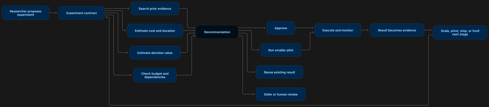

# R&D Capital Intelligence
   

A website for an agentic AI product that translates technical R&D evidence into finance-ready capital allocation decisions.

## Research included

The website links to research on:

- soft information and hierarchical capital allocation
- financing frictions in R&D
- internal capital markets and innovation
- short-term financial reporting incentives
- rent-seeking and misallocation
- staged R&D funding / real options
- experimentation as information production
- risk aversion in R&D selection

Illustrative financial examples are hypothetical.
