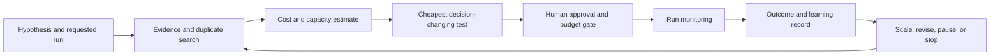

# GPU Experiment Allocator

### An R&D Capital Intelligence concept

> Every expensive GPU experiment should have a reason, a stopping rule, and a
> record of what decision it changed.

GPU Experiment Allocator is a concept for a human-in-the-loop AI decision system
that helps teams decide **which GPU experiments to run, at what scale, and when
to stop**.

It is the first product in a broader R&D Capital Intelligence vision: connecting
technical progress to economics, staged funding, and portfolio reallocation. The
system is not meant to predict which ideas will succeed. It is meant to help a
company spend the least capital necessary to discover which ideas deserve more.


## The problem

Engineering and finance see different parts of an R&D decision. Researchers
understand the hypothesis, technical uncertainty, and likely learning. Finance
sees budget, risk, timing, and competing uses of capital. The information between
them is often spread across experiment trackers, cloud bills, tickets,
documents, and individual judgment.

That gap creates recurring problems:

- expensive runs begin without a clear decision or success threshold;
- teams repeat experiments or failures that already exist elsewhere;
- full-scale runs are funded before cheaper proxy tests are attempted;
- predicted cost, actual cost, and decision value are rarely compared;
- negative results disappear instead of becoming reusable knowledge; and
- compute goes to the most persuasive request, not always the most valuable
  uncertainty.

This is not simply a FinOps problem. Lower GPU spend is useful, but the larger
goal is to help high-value experiments reach the queue faster and turn every run
into evidence the organization can reuse.

## What we are building

The allocator would connect to an experiment tracker such as MLflow or Weights &
Biases, a compute environment such as Kubernetes or Slurm, cloud billing, and a
project-management system.

Before an expensive run is approved, it would ask:

- What hypothesis is this run testing?
- What product, architecture, or funding decision will its result change?
- Has this experiment, or a close variant, already been run?
- Is there a cheaper pilot that can resolve the same uncertainty?
- What will the run cost, and what budget or capacity will it consume?
- What result should unlock more compute, trigger a redesign, or stop the work?

It would then recommend one of a small number of actions: **run the pilot,
approve with limits, reserve a larger follow-on run, narrow the experiment,
reuse existing evidence, defer it, or stop it**. A human owner remains
responsible for the decision.

## How it works



The system manages a **sequence of learning and conditional capital**, rather
than producing a single magic project score. A useful recommendation combines:

- the probability that evidence will change a decision;
- the value at stake in that decision;
- the reusable learning created by the experiment;
- compute, labor, and delay cost; and
- portfolio constraints such as GPU capacity, engineering time, and budget.

The output is an auditable recommendation showing sources, assumptions,
uncertainty ranges, alternatives considered, and the milestone required for the
next tranche of compute.

## Example

A researcher proposes an inference-optimization experiment requiring eight
H100s for 12 hours. The allocator finds similar internal runs, estimates cost
and queue time, identifies the latency threshold that would change the scaling
decision, and checks budget and dependencies.

It can then recommend the full run, a cheaper pilot, reuse of an existing result,
or human review. After execution, the observed result becomes evidence for the
next allocation decision instead of disappearing in an isolated experiment log.

The objective is not to spend less at all costs. It is to spend the **least
capital necessary to discover which ideas deserve more capital**.

## Initial MVP

The first version should remain intentionally small:

- one experiment-tracker integration;
- one execution environment;
- an internal GPU-hour cost model;
- a CLI or simple experiment-submission form;
- similar-experiment and prior-failure retrieval;
- requested-versus-predicted cost;
- pilot, scale-up, defer, and stop recommendations;
- budget and runtime alerts;
- a manager approval inbox; and
- a post-experiment learning record tied to the decision it informed.

The MVP should launch in **shadow mode**: it makes recommendations but blocks
nothing. After teams can measure its accuracy and usefulness, preflight review
can be introduced only for jobs above a configurable cost or GPU-hour threshold.

## Product principles

- **Advisory before autonomous.** Researchers and managers retain control,
  especially while the system learns an organization's context.
- **Ranges over false precision.** Show assumptions and sensitivity instead of
  hiding uncertainty behind one authoritative score.
- **Protect exploration.** Maintain a separate budget for moonshots and
  open-ended research so an optimizer does not favor only predictable work.
- **Reward learning, including negative results.** A stopped experiment can be
  valuable if it prevents a larger mistake or leaves reusable evidence.
- **Optimize decisions, not utilization.** A busy GPU fleet is not automatically
  a productive R&D portfolio.
- **Make recommendations auditable.** Every decision should link back to the
  evidence, cost model, alternatives, and human approver.

## Long-term vision

The broader platform becomes an experiment-decision graph:

```text
Hypothesis -> Experiment -> Cost -> Evidence -> Decision -> Funding -> Outcome
```

That history can help an organization learn which proxy tests predict
full-scale outcomes, which experiment types routinely overrun, which early
signals are useful, and which negative findings are repeatedly rediscovered.

The product can mature in three stages:

1. **Observer** — identify cost, duplication, missing success criteria, and
   missing decision context.
2. **Advisor** — recommend pilots, stopping rules, priorities, and staged
   budgets.
3. **Governor** — enforce approved limits and release conditional compute only
   after the organization has established sufficient trust and controls.

## Current prototype

This repository currently contains a **static concept website**, not a
production allocation engine. It demonstrates:

- the finance-to-engineering translation problem;
- a proposed multi-agent decision system;
- a simple, rule-based staged-funding simulator;
- the initial AI-infrastructure use case; and
- research supporting the product thesis.

The site has no backend, model calls, external integrations, authentication,
persistent data, GPU scheduler, or automated approval capability. Financial
examples are illustrative and hypothetical, and are not investment advice.

## Run locally

No build step or package installation is required.

```bash
git clone https://github.com/vattsall/rd-capital-ai.git
cd rd-capital-ai
python3 -m http.server 8000
```

Open [http://localhost:8000](http://localhost:8000) in a browser. The page uses
Google Fonts, so those fonts require an internet connection; the rest of the
prototype runs locally.

## Repository structure

```text
.
├── index.html                 # Concept site and research links
├── styles.css                 # Responsive visual design
├── script.js                  # Interactive funding simulator
└── images/
    └── mermaid-diagram.png    # Experiment allocation workflow
```

## Research direction

The concept is informed by work on soft information and hierarchical capital
allocation, R&D financing frictions, internal capital markets, real options,
experimentation as information production, and risk aversion in R&D selection.
The website links to the papers and explains how each one relates to the product
thesis.
